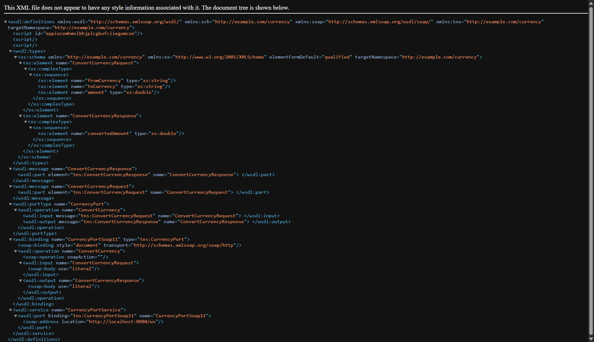
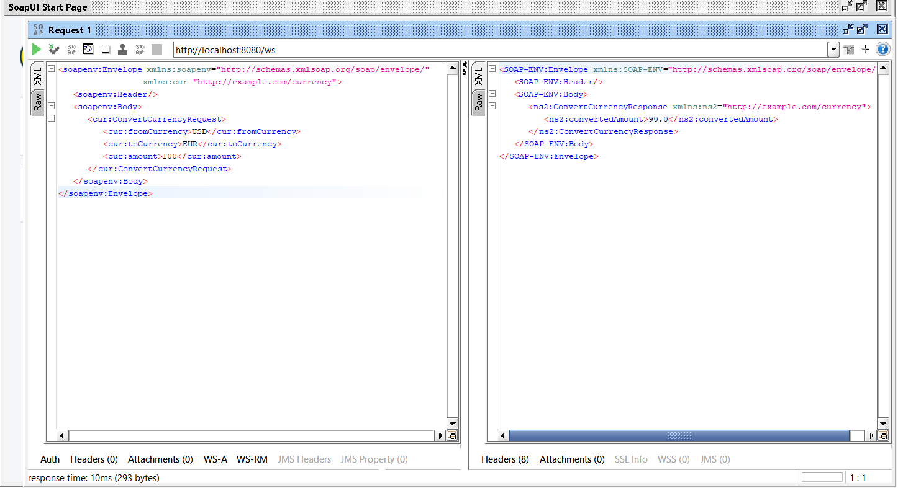

# Currency Converter SOAP Web Service

This project is a simple Spring Boot SOAP-based web service that performs currency conversion.

## 🧪 Web Service in Action

### 🧾 WSDL File (Auto-generated)


### 📬 SOAP Request via SoapUI


## 🛠 Endpoint

- **WSDL URL**: `http://localhost:8080/ws/currencyConverter.wsdl`
- **SOAP Endpoint**: `http://localhost:8080/ws`

## ✅ Example Request (SOAP)

```xml
<soapenv:Envelope xmlns:soapenv="http://schemas.xmlsoap.org/soap/envelope/" xmlns:cur="http://example.com/currency">
  <soapenv:Header/>
  <soapenv:Body>
    <cur:ConvertCurrencyRequest>
      <cur:fromCurrency>USD</cur:fromCurrency>
      <cur:toCurrency>EUR</cur:toCurrency>
      <cur:amount>100</cur:amount>
    </cur:ConvertCurrencyRequest>
  </soapenv:Body>
</soapenv:Envelope>
